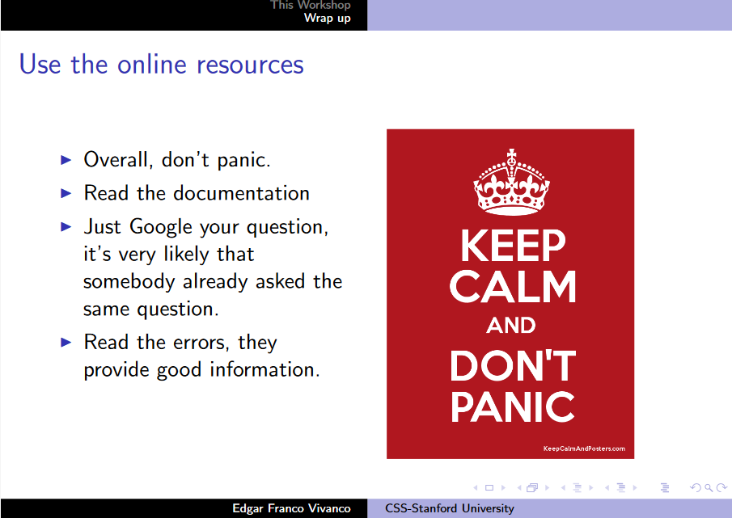
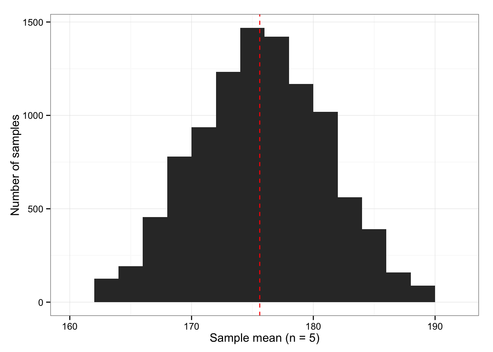

# R Basics #2

## Resources

[1] [视频：Stanford Seminar - Expressing yourself in R 现在看前10min就行，后面的比较高深](https://www.youtube.com/watch?v=wki0BqlztCo)

[2] [资源：Stanford Resources: Workshops, Consultations, Tutorials and more](Resources: Workshops, Consultations, Tutorials and more)

[3] [视频：R Programming Tutorial - Learn the Basics of Statistical Computing 画各种图](https://www.youtube.com/watch?v=_V8eKsto3Ug)

[4] [★★★★★ R Tutorials Document：Basics & Statistics](https://sejdemyr.github.io/#r-tutorials)

（可以多翻翻Stanford给的蛮多的资源链接）



## Conditional Statements

### `if`、`else if`、`else`

`if`、`else if`、`else`的用法和C、C++、Java非常相似，但语法上略有不同


```r
x<-30
print(class(x)) # numeric数据类型
if(is.integer(x)){ # is.integer判断x是否是整型，x不是整型 (2L这种才是，末尾要有L)
  print("int")
}else if(is.numeric(x)){ # 一定要和}在同一行，换行会报错
  print("num")
}else{ # 同样要和}在同一行
  print("nonono")
}
```

- `if`
- `if...else if(可有多个)`
- `if...else`
- `if...else if(可有多个)...else`

这几个结构都是类似的

### `switch`

- **格式**：`switch(expression, case1, case2, case3....)`
- **switch** 语句中的 `expression`是一个常量表达式，可以是整数或字符串，如果是整数则返回对应的`case`位置值，如果整数不在位置的范围内则返回`NULL`
- 如果匹配到多个值则返回第一个
- `expression`如果是字符串，则对应的是`case`中的变量名对应的值，没有匹配则没有返回值。
- `switch`没有默认参数可用，即一定有`expression`、`case`

```r
> switch(2,"google","instagram","taobao","weibo")
[1] "instagram"

> switch("a", a="aa", b = "bb", c = "cc")
[1] "aa"
```

## Loops

R里面实现循环的方式蛮多的：`repeat`、`while`、`for`，循环控制语句亦有`break`、`next`

以下我将分别用`repeat`、`while`、`for`实现从1加到100

### `repeat`

```r
a<-c(1:100)
sum<-0
i<-1
sum<-0
repeat{
  sum<-sum+a[i]
  if(i==10){
    break # 跳出当前循环
  }
  i<-i+1
}
print(sum)
```

### `while`

```r
sum<-0
i<-1
while(i<=100){
  sum=sum+i
  i=i+1
}
print(sum)
```

### `for`

```r
sum<-0
for(i in 1:100){
  sum=sum+i
}
print(sum)
```

### `break` & `next`

```r
# break 和Python中的一样，在repeat的例子中也写了
# next 相当于Python中的continue，跳过当前循环，继续下一个
a<-c(1:5)
for(i in a){
  if(i==3){
    next
  }
  print(a[i])
}
```

## An appliction (Monte Carlo simulation)

For loops can be used to carry out Monte Carlo simulations. In the  example below, we’ll draw repeated samples from a population, calculate  the mean for each sample, and test whether we on average do a good job  of estimating the population mean.

Say the population consists of 10 individuals with the following heights:

```r
v <- c(175, 182, 150, 187, 165, 177, 200, 198, 157, 165)
mean(v)    # population mean
 [1] 175.6
```

Unfortunately, for whatever reason, we do not know the heights of all of these individuals. We can only (randomly) sample 5 of them. From  this random sample of five individuals we estimate the height of all 10  individuals. We can draw a sample of 5 from `v` and take the mean of this sample using the following code:

```r
v <- c(175, 182, 150, 187, 165, 177, 200, 198, 157, 165)
smpl <- sample(v, 5)
mean(smpl)
 [1] 173.8
```

Would we on average expect to estimate the mean of the population  accurately? Let’s use a Monte Carlo simulation to find out. We’ll draw  10,000 random samples of five from `v` and take the mean of  each of these samples. With an unbiased estimator we would, on average,  expect the sample estimate to equal the population parameter of  interest.

```r
n <- 10000
smpl_means <- rep(NA, n)
for(i in 1:n){
    smpl <- sample(v, 5)
    smpl_means[i] <- mean(smpl)
}

mean(smpl_means)
 [1] 175.674
```

The mean of the sample means (175.67396) is very close to the  population mean (175.6): on average, we’re accurately estimating the  population mean with our random sample of five individuals.

Note, though, that in some cases our estimate is quite far from the  population mean. To illustrate this, we can plot a histogram of the  sample means:

```r
# 以下ggplot2开始应该是没装的，用下面这行安装
# install.packages("tidyverse")
# The tidyverse is an opinionated collection of R packages designed for data science. 非常常用
require(ggplot2)
ggplot(data.frame(smpl_means), aes(x = smpl_means)) +
    geom_histogram(binwidth = 2) +
    geom_vline(xintercept = mean(v), color = "red", linetype = 2) +
    xlab("Sample mean (n = 5)") +
    ylab("Number of samples") + 
    theme_bw()
```



The dashed red line indicates the population mean. While our sample  estimates are centered around this mean (good news!), the range of the  estimates is quite large. In fact, about 10% of the time we’d get an  estimate of the mean that is either almost 9 centimeters (3.5 inches)  below the actual mean or almost 9 centimeters above the actual mean:

```r
quantile(smpl_means, probs = c(0.05, 0.95))
    5%   95% 
 166.8 184.4
```

## Exercises

1. Use a for loop to take the square root of each value in the following vector: `vec1 <- c(4, 9, 81, 100, 1000, 10^6)`. Save the results to a new vector called `vec2`.
2. Monte Carlo Simulation: Imagine that the values in the vector `pop` below represent vote shares for a presidential candidate across the  3,144 counties in the United States. If we were to take a sample of 50  counties and estimate mean support for the presidential candidate, would we, on average, estimate the vote share across all counties accurately? (Don’t worry about the fact that we really should be weighing counties  by their population size to estimate overall support.) Draw 10,000  samples of 50 counties from `pop` and estimate mean support for each sample, saving each mean estimate into a vector called `smpl_means`. How does the mean of the sample means compare to the population mean?  Do we, on average, do a good job of estimating the population mean?

> `pop <- runif(n = 3144, min = 0, max = 1)`
